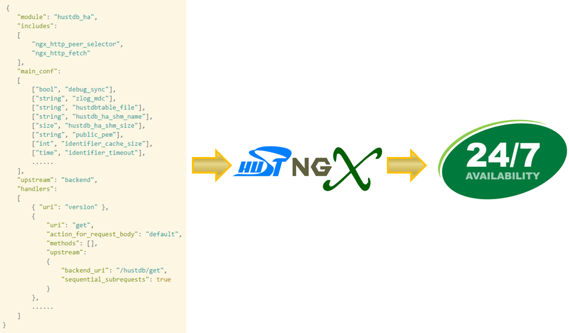
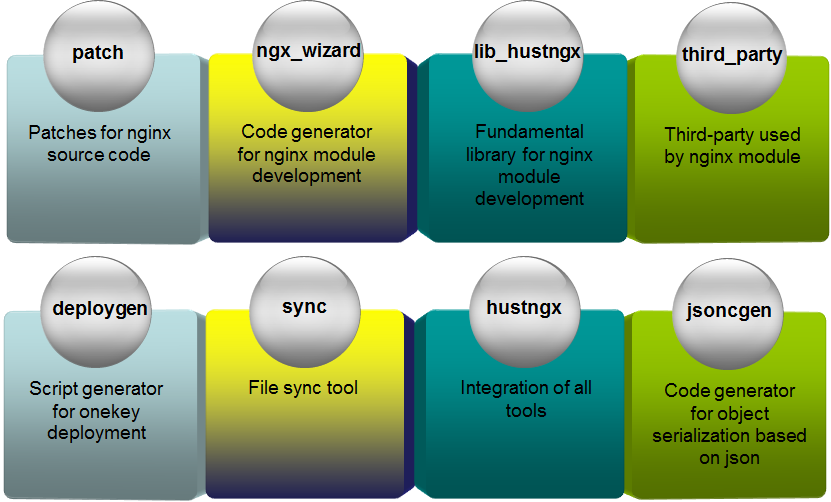

[简体中文](README_ZH.md)

# hustngx - nginx module development tool kit for lazy man #

## What is hustngx? ##

hustngx is a framework used for nginx module development, with automation feature on code generator.

If you:  

- Know nothing about nginx source code
- Know nothing about nginx configuration
- Know nothing about how to build nginx
- Know nothing about how to debug nginx
- Know nothing about nginx module
- Know nothing about upstream, proxy, subrequest

Then, you'd better study the contents as below before starting to use hustngx:  

> [Emiller's Advanced Topics In Nginx Module Development](http://www.evanmiller.org/nginx-modules-guide-advanced.html)

**Without the accumulation of knowledge as above, you**：  

- **Will be hard to understand the paradigm concluded by hustngx**

- **Will still be all at sea even it has generated a great deal of code for you**

For issues on nginx configuration, please refer to here:

> [nginx configuration on upstream](http://nginx.org/en/docs/http/ngx_http_upstream_module.html)

> [nginx configuration on proxy](http://nginx.org/en/docs/http/ngx_http_proxy_module.html)

If you:  

- **own prime material for nginx module development**

- require a functional fundamental library for nginx module development

- require a automation tool kit for **mass development** on nginx module

- do not want to be beset by problems on subrequest during nginx module development

Then hustngx is the right tool kit tailored for you. You will **work faster and smarter** with hustngx.  

## What does hustngx have? ##

## Limitation ##

**The latest hustngx supports nginx 1.12.0 stable version**

## Usage ##

Untar `hustngx.tar.gz`, cd to folder `hustngx`, edit file `hello.json` and add contents as below:  

    {
        "module": "hustmqha",
        "handlers":
        [
            {
                "uri": "test"
            }
        ]
    }

Run command:  

    python hustngx.py nginx-1.12.0.tar.gz hello.json

Then folder `hustmqha` will be generated. switch to this folder and you will see the following files:  

    nginx            # nginx src folder
    deploygen.py     # script generator for onekey deployment
    deploy_ngx.json  # configuration for deploygen.py
    hosts            # machines configuration for deploygen.py
    deploy.sh        # onekey deployment script (generated by deploygen.py+deploy_ngx.json+hosts)
    upgrade.sh       # nginx smooth upgrade script

Switch to folder `nginx/conf`, edit file `sample.json` as below:  

    {
	    "module": "hustmqha",
	    "worker_connections": 1048576,
	    "listen": 8080,
	    "local_cmds": ["/test"]
	}

Generate nginx configuration:  

    python genconf.py sample.json

Build and install nginx:  

    cd hustmqha/nginx/
    sh Config.sh && make install

After installed, start nginx:  

    cd /data/hustmqha/sbin
    ./nginx

Input the following test command:  

    curl -i -X GET 'localhost:8080/test'

Then server will output the following information:  

    HTTP/1.1 200 OK
	Server: nginx/1.12.0
	Date: Tue, 18 Apr 2017 03:54:37 GMT
	Content-Type: text/plain
	Content-Length: 12
	Connection: keep-alive
	
	Hello World!

Server works just fine if the above result is returned.  

## Documents ##

More details see in [here](doc/en/index.md)。

## License ##

`hustngx` is licensed under [New BSD License](https://opensource.org/licenses/BSD-3-Clause), a very flexible license to use.

## Author ##

* chengzhuo (jobs, yao050421103@163.com)  

## More ##

- High-performance Distributed Storage - [huststore](https://github.com/Qihoo360/huststore)