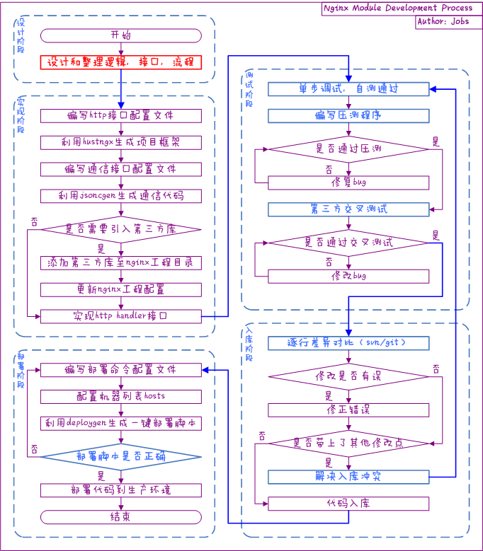

Nginx Module Development Process
--

### 工序流程图 ###

### 工序流程要点说明 ###

- **红色标注的工序通常经验越丰富，越关注这块，反之越不关注**
- **蓝色标注的是最容易忽略，但最容易出事故的流程**  
- http 接口配置文件可参考 [ngx_wizard](../advanced/ngx_wizard.md) 的相关说明
- 通信接口配置文件可参考 [jsoncgen](../advanced/jsoncgen.md) 的相关说明  
- nginx 工程配置的更新可参考 [附录](../appendix/project.md)  
- 测试阶段的 **单测、压测和交叉测试** 是保证程序可用的关键， **任何一步都不可省略** 。  
	- 单测主要保证程序 **基本功能可用** ，可用单步调试的方法 **走完程序的每一个逻辑分支** 。  
    - 压测主要用于保证程序在重复处理大量请求的情况下， **不出现任何资源泄露的问题** 。压测的脚本通常由开发模块的人员自行完成。
    - 交叉测试的执行人员通常由 **第三方** 的开发或者测试担任（不能由开发模块的人员执行），用于保证程序的容错性和高可用性。
- 代码入库的流程通常是开发者极其容易忽略的一个环节。
	- 如果工程只有一个开发者独立完成，则该流程可忽略。  
	- 一旦涉及到 **多个开发者** 并行工作，该流程务必要严格执行，否则非常容易出现 **将不该入库的代码入库** 的情况，这将导致在测试出现问题的时候 **无法高效定位** 。
- 部署命令配置文件可参考 [deploygen](../advanced/deploygen.md) 的相关说明  
- 部署脚本的检查是上线前的最后一道工序。该工序 **绝对不能省略** ，否则一旦部署出现问题，会 **直接影响线上业务的稳定运行** ，损失难以估量。检查要点包括：
	- 部署命令是否正确，可以在测试机器中进行部署，看结果是否正确。
	- 部署的主机列表是否正确，可通过文本比对工具进行比较。  

[上一级](index.md)

[回首页](../index.md)